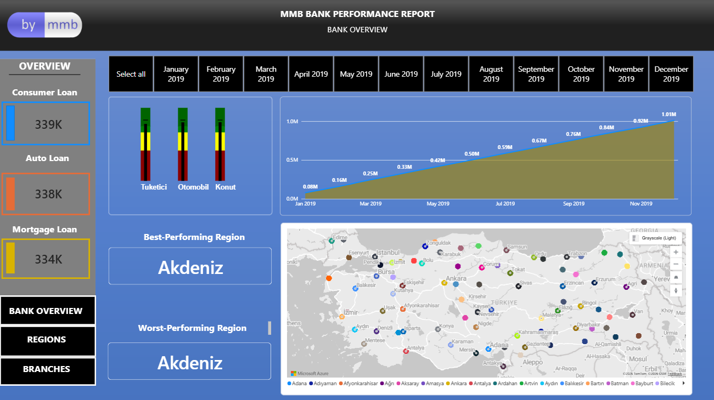
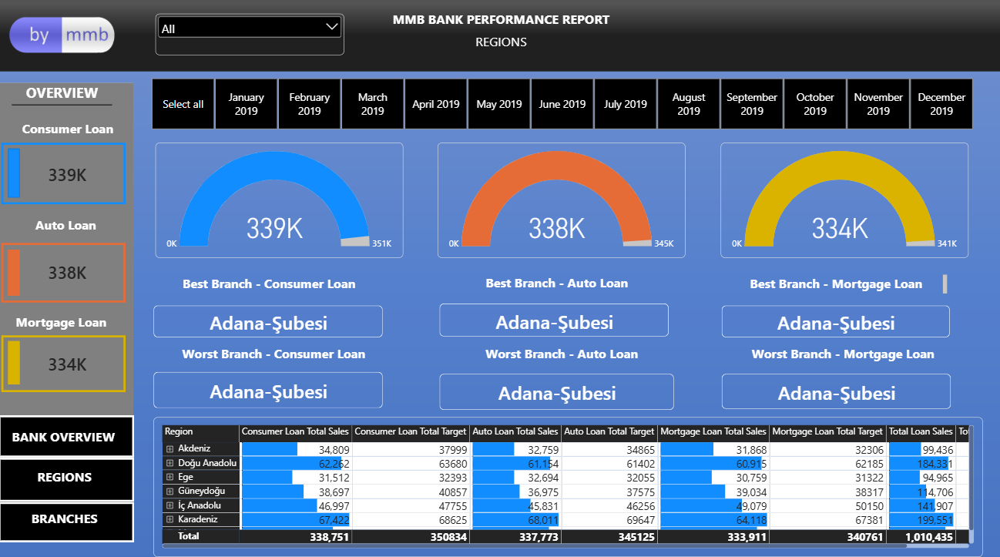
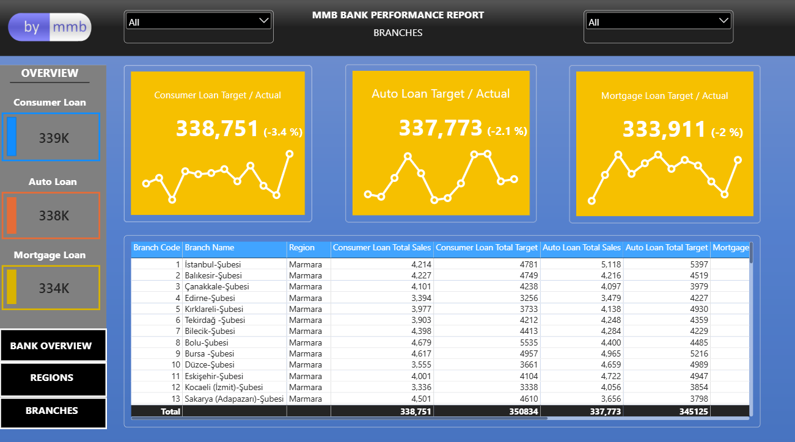

# Bank Loan Performance Dashboard

## Project Overview

This project presents an interactive Power BI dashboard designed to analyze bank loan performance across the bank, regional, and branch levels.

The dashboard enables users to monitor loan sales, compare actual performance against targets, and analyze performance across different loan categories, regions, branches, and periods.

## Dashboard Pages

### Bank Overview

Provides a high-level overview of the bank's overall loan performance.

Key areas include:

- Total loan sales
- Loan targets
- Actual vs. target performance
- Loan category performance
- Monthly performance trends
- Regional performance

### Regional Analysis

Provides a regional-level analysis of loan performance.

Key areas include:

- Regional loan sales
- Target vs. actual performance
- Loan category distribution
- Regional performance comparison
- Cumulative performance

### Branch Analysis

Provides a detailed analysis of individual branch performance.

Key areas include:

- Branch sales performance
- Branch targets
- Actual vs. target performance
- Loan category performance
- Monthly performance

## Loan Categories

The dashboard analyzes three main loan categories:

- Consumer Loan
- Auto Loan
- Mortgage Loan

## Key Features

- Interactive filtering
- KPI cards
- Target vs. actual analysis
- Cumulative performance analysis
- Regional analysis
- Branch-level analysis
- Geographic visualization
- Interactive bookmarks
- Monthly performance tracking

## Tools & Technologies

- Power BI
- Power Query
- DAX
- Data Modeling
- Data Visualization

## Dashboard Preview

### Bank Overview



### Regional Analysis



### Branch Analysis



## Key Insights

The dashboard can be used to identify:

- Regions with the highest and lowest loan sales performance
- Branches with stronger or weaker performance against targets
- Differences in performance across loan categories
- Monthly changes in loan sales
- Cumulative performance trends

## Project Structure

```text
bank-loan-performance-dashboard/
│
├── README.md
│
├── PowerBI/
│   └── bank-loan-performance-dashboard.pbix
│
└── Screenshots/
    ├── bank-overview.png
    ├── regional-analysis.png
    └── branch-analysis.png
```
Author

Mahammad Ramazanli
